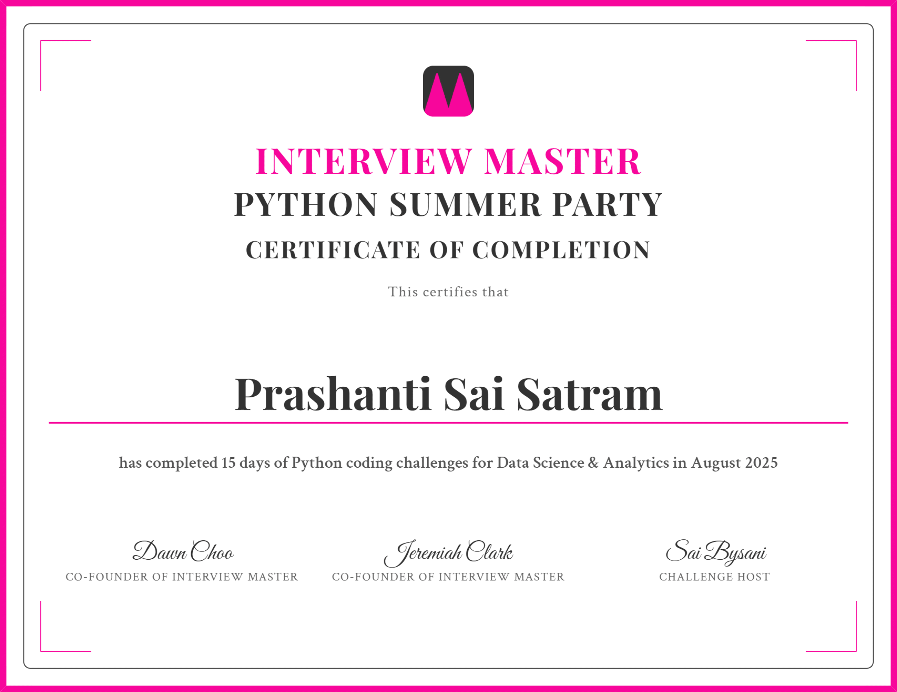

# Python Summer Party – 15 Days Data Analysis Challenge

This repository contains my solutions for the **Python Summer Party Challenge (August 2025)** organized by **Interview Master**.  
Over **15 days**, I solved real-world business problems using **Python, Pandas, and Jupyter Notebooks**, applying data analytics concepts to practical case studies across multiple domains.

---

## 🚀 Challenge Overview
- **Duration:** 15 Days (August 2025)  
- **Focus:** Data Science & Business Analytics with Python  
- **Format:** Daily Jupyter Notebooks with structured business cases  
- **Final Case:** Business Analyst role at **Uber**, optimizing driver compensation using trip-level data.

This repository demonstrates my ability to **structure analysis logically, calculate KPIs, and communicate insights clearly**.

---

## 📂 Repository Structure
Each notebook represents one day’s challenge:

- **Day 01:** Marketing campaign analysis – customer response patterns  
- **Day 02:** Customer churn calculation – retention metrics  
- **Day 03:** Sales growth analysis – tracking revenue performance  
- **Day 04:** Transaction difference analysis – financial tracking  
- **Day 05:** Product category trends – identifying high-value products  
- **Day 06:** Subscription plan analysis – customer upgrades/downgrades  
- **Day 07:** Profitability by region – business expansion insights  
- **Day 08:** Website traffic conversion – funnel analysis  
- **Day 09:** Loyalty program impact – purchase behavior  
- **Day 10:** Seasonal sales analysis – quarterly performance review  
- **Day 11:** Customer segmentation – grouping by behavior metrics  
- **Day 12:** Employee productivity – performance KPIs  
- **Day 13:** Supply chain delays – vendor performance  
- **Day 14:** Retail store comparison – benchmarking metrics  
- **Day 15:** Uber driver earnings optimization – rider count vs distance analysis  

*(Each notebook is self-contained, with problem statement, approach, and solution code.)*

---

## 🛠️ Tools & Skills
- **Python** (Pandas, NumPy)  
- **Jupyter Notebook / Jupyter Lab**  
- **Data Cleaning & Transformation**  
- **Filtering, Grouping, Aggregation**  
- **KPI Calculation** (e.g., churn rate, earnings per trip, transaction differences)  
- **Business Analytics** (marketing, operations, HR, finance, ride-sharing)

---

## 🔧 How to Use
1. Clone this repository:  
   ```bash
   git clone https://github.com/your-username/python-summer-party.git
   cd python-summer-party
Create and activate a Python environment (venv or conda).

bash
Copy
Edit
python -m venv venv
source venv/bin/activate   # Mac/Linux
venv\Scripts\activate      # Windows
Install dependencies:

bash
Copy
Edit
pip install jupyterlab pandas numpy
Launch Jupyter Lab or Notebook and open any day-XX.ipynb file to explore the solutions:

bash
Copy
Edit
jupyter lab
🏆 Certificate

Successfully completed 15 Days of Python Coding Challenges for Data Science & Analytics in August 2025.
  

💡 Key Learnings
Strengthened hands-on skills in data analysis with Python.

Built confidence in solving open-ended business problems.

Learned to communicate insights clearly using efficient and simple code.

Developed consistency and logical thinking through daily practice.

🙏 Acknowledgment
Special thanks to Dawn Choo, Venkata Naga Sai Kumar Bysani, and Jeremiah Clark for organizing this hands-on learning experience and making data analysis fun and practical.

📖 About Interview Master
These challenges are hosted by Interview Master — a platform for preparing for Data Science & Analytics interviews.
Learn more at [interviewmaster.ai](https://www.interviewmaster.ai).
